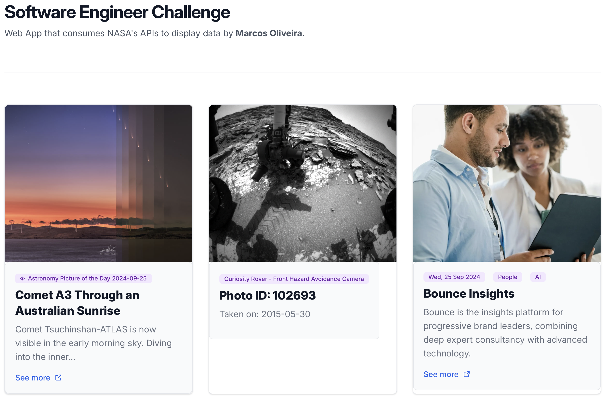

  <h1 align="center">Bounce Insights - Software Engineer</h1>

  

## About
This is a FullStack project, that consumes <a href='https://api.nasa.gov/)'>`NASA's Open APIs`</a> to display data. This project aims to showcase space-related. This project is built using: `React Frontend`, and `NodeJS Backend` while running `Express` to create routes, and so much more!

## Front-end
- React.JS + Vite.JS
- TypeScript
- TailwindCSS
- Radix-UI

## Back-end
- Node.JS
- Typescript + TSX
- Express

## Run the App
- /frontend:
> npm install

and

> npm run dev

- /backend:
> npm install

and
> npm run dev

## References
This project is part of a coding challenge proposed by <a href='https://www.bounceinsights.com'>Bounce Insights</a>, which is the insights platform for progressive brand leaders, combining deep expert consultancy with advanced technology.

## Copyright Disclaimer
Please note that this project is non-profit or not intended to be monetized.

---

<strong>Built with 💙 by [@Marcos Oliveira](https://www.linkedin.com/in/pgmarcosoliveira/)</strong>